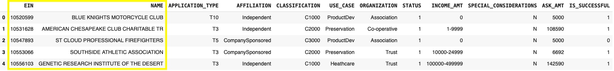

# deep-learning-challenge

## Report on the Neural Network Model

1. **Overview of the analysis:**

The nonprofit foundation Alphabet Soup wants a tool that can help it select the applicants for funding with the best chance of success in their ventures.

The purpose of this challenge is to create a neural network model able to predict, with adequate accuracy, whether applicants will be successful if funded by Alphabet Soup.

The analysis begins with a dataset of more than 34,000 organizations that have received funding from Alphabet Soup over the years. The features (columns) present in this dataset are:
- EIN and NAME—Identification columns
- APPLICATION_TYPE—Alphabet Soup application type
- AFFILIATION—Affiliated sector of industry
- CLASSIFICATION—Government organization classification
- USE_CASE—Use case for funding
- ORGANIZATION—Organization type
- STATUS—Active status
- INCOME_AMT—Income classification
- SPECIAL_CONSIDERATIONS—Special considerations for application
- ASK_AMT—Funding amount requested
- IS_SUCCESSFUL—Was the money used effectively

2. **Results:**

    - **Data Preprocessing**

        - Steps
            - The first step was to reduce the number of values in the columns "APPLICATION_TYPE" and "CLASSIFICATION", leaving the values with higher occurrences and grouping the rest in a value called "others". "APPLICATION_TYPE" was left with 9 values and "CLASSIFICATION" with 6. This step has the objective of reducing outliers.
            - Then I proceed to create the dummies for the categorical values.
            - Then the data was split in train and test data, and it was scaled using StandardScaler.

        - What variable is the target for the model?

            The target variable is the feature **IS_SUCCESSFUL** which is a Boolean variable that takes values of 1 when the applicant was successful and 0 when not successful.

            

        - What variables are the features for the model?

            The variables used as features for the model are:

            - **APPLICATION_TYPE**: 17 types of applications with an alphanumeric code
            - **AFFILIATION**: Categorical variable showing the applicant's affiliated sector of industry (6 unique values)
            - **CLASSIFICATION**: 71 different government organization classification
            - **USE_CASE**: Another categorical variable with 5 unique values showing the use case for funding
            - **ORGANIZATION**: 4 different applicant's organization type
            - **STATUS**: Boolean variable showing the application status
            - **INCOME_AMT**: 9 ranges to classify the applicant's income level
            - **SPECIAL_CONSIDERATIONS**: Boolean variable specifying if there are special considerations for the application
            - **ASK_AMT**: Numerical variable that shows the funds requested

            

        - What variables were removed from the input data because they are neither targets nor features?

            The variables that won't be used in the model are **EIN** and **NAME** as they are identification columns.

            

    - **Compiling, Training, and Evaluating the Model**

        - How many neurons, layers, and activation functions were selected in the neural network model, and why?

            - The initial model was set with 3 layers (Input, hidden and output) as a basic model
            - 20 neurons were selected in the input layer, a number within the range recommended which is up to the number of features (43)
            - For the hidden layer 10 neurons were selected to reduce the neurons towards the output of the model.
            - Finally for the output layer, 1 neuron was selected to obtain the binary response I was looking for.
            - In terms of the activation functions I used relu for the input and hidden layers and sigmoid for the output.

            

        - Did the model achieve the target model performance?

            - The initial model did not achieve the target performance. After 100 Epochs the accuracy reached was 72.9090%.

            

        - What steps were taken in the attempts to increase model performance?

            - Using a boxplot and calculating the quartiles, lower and higher bounds, outliers in the "ASK_AMT" feature were eliminated.
            - The number of bins for the "APPLICATION_TYPE" and "CLASSIFICATION" were increased in one (from 9 to 10 and from 6 to 7 respectively) to increase potential important components. This brought the total features to 45.
            -  keras-tuner was used to obtain optimal combination of hyperparameters.
                - A unique hidden layer was maintained
                - The best tuner result suggested to change the activation function to tanh for the initial layer and hidden layer
                - Neurons in the input layer were increased to 105 and to 16 in the hidden layer.
            - After 100 Epochs, although the model increased its accuracy to 74.7241%, the target accuracy was not reached.

            

            

3. **Summary:**

    - After optimization, the model did not reach the target accuracy, which means I would not recommend its usage to predict if applicants will be successful if funded by Alphabet Soup.
    - I would recommend trying K-Nearest Neighbors (KNN) model. This is a simpler model used for small to medium-sized datasets and can achieve the target accuracy if the outliers are removed from the dataset. It does not require training phase and requires less computational resources.
